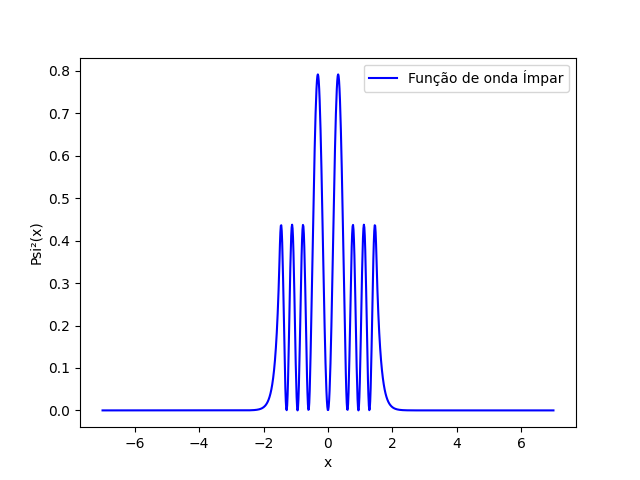

# 🌊 dwell_routine

> Solução analítica e numérica da Equação de Schrödinger para o 
> potencial duplo finito — aproximação ao comportamento quântico 
> da molécula de amônia (NH₃).

## 📌 Sobre o Projeto

Este projeto implementa as funções de onda normalizadas para o 
problema do poço duplo finito, abordando o problema tanto de forma 
analítica quanto numérica (matricial), por meio do operador 
Hamiltoniano.

A solução numérica foi construída diagonalizando uma matriz 
**3000×3000**, utilizando o poço infinito como base, para obtenção 
dos autovetores e autovalores do Hamiltoniano. Testes com matrizes 
de 5000×5000 foram realizados, porém o custo computacional aumentou 
significativamente com ganhos de precisão marginais — confirmando 
que a ordem 3000×3000 representa o melhor equilíbrio entre 
precisão e desempenho.

Os resultados foram comparados com a solução analítica, 
apresentando erros relativos abaixo de **0.1% para os primeiros 
9 níveis de energia** — evidenciando a eficiência do método.

Os parâmetros e a abordagem teórica foram adaptados de 
Peacock-López (2006) e Neto (2012). A implementação numérica, 
incluindo o módulo `finder_roots` — capaz de detectar raízes de 
equações transcendentais com coeficientes complexos —, foi 
desenvolvida pelo orientador do projeto (Kühn, 2004).

## 🎯 Objetivos

- Resolver a Equação de Schrödinger unidimensional e independente 
  do tempo para o potencial duplo finito
- Comparar a solução analítica com o tratamento matricial numérico
- Validar a eficiência do método via percentual de erro relativo 
  nas autoenergias
- Identificar a paridade das funções de onda a partir da simetria 
  do potencial

## 📊 Resultados

Densidade de probabilidade |ψ²(x)| para a função de onda par — 
note os dois picos simétricos característicos do poço duplo finito:



A comparação entre os valores analíticos e numéricos das 
autoenergias (eV) demonstrou alta precisão do método matricial:

| Nível (m,n) | Analítico (eV) | Numérico (eV) | Erro (%) |
|:-----------:|:--------------:|:-------------:|:--------:|
| 1 | 47.270975... | 47.269403... | 0.003 |
| 2 | 47.202373... | 47.200772... | 0.003 |
| 3 | 40.482219... | 40.478262... | 0.009 |
| 4 | 39.395511... | 39.389479... | 0.015 |
| 5 | 34.548022... | 34.543695... | 0.013 |
| 6 | 28.817307... | 28.908836... | 0.029 |
| 7 | 23.619975... | 23.608104... | 0.198 |
| 8 | 16.753385... | 16.740308... | 0.050 |
| 9 | 8.593518... | 8.576764... | 0.296 |
| 10 | 1.304925... | 1.286625... | 1.402 |

## 🛠️ Tecnologias

- Python 3.8
- NumPy
- Matplotlib
- SciPy

## 📁 Estrutura do Repositório

```
dwell/
├── Eig_E/              # Módulo de autoenergias
│   ├── eig_energy.py
│   └── finder_roots.py # Localizador de raízes de equações transcendentais
├── Graph/
│   └── graph-01.png    # Gráficos gerados
├── dat/
│   └── eig_energy_total.txt
├── dwell_analytic.py   # Solução analítica
├── eigen_function.py   # Funções de onda
├── config.ini          # Parâmetros do potencial
└── __init__.py
```

## 🚀 Como Executar

```bash
git clone https://github.com/hipolito-physics/dwell_routine
cd dwell_routine
python dwell/dwell_analytic.py
```

## 🔭 Trabalhos Futuros

- Implementação de pacote de ondas no poço duplo finito para 
  análise da dinâmica e efeito de tunelamento
- Análise de potenciais alternativos: Rosen-Morse, Manning, 
  Dennison-Uhlenbeck, com valores experimentais da amônia 
  e possivelmente da amônia deuterada
- Estudo dos aspectos rotacionais, vibracionais e eletrônicos 
  de moléculas com estrutura piramidal
- Proposta de solução iterativa para melhoria da base numérica

## 👤 Autor

Desenvolvido como Trabalho de Conclusão de Curso em Física.

## 📚 Referências

KÜHN, J. *Estudo da dinâmica de pacotes de ondas em bilhares 
quânticos*. 89 f. Dissertação (Mestrado em Ciências - Setor de 
Ciências Exatas) — Universidade Federal do Paraná, Curitiba, 2004.

NETO, A. F. *O potencial duplo e a molécula de amônia*. 
69 f. Dissertação (Mestrado em Física) — Universidade Estadual 
Paulista, São Paulo, 2012.

PEACOCK-LÓPEZ, E. *Exact solutions of the infinite spherical 
well with inverse-square potential*. 2006.
